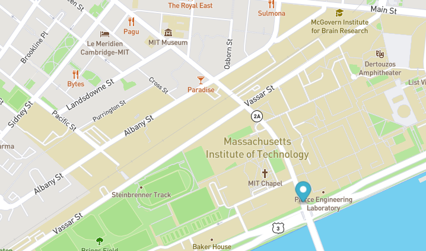

# Real-Time-Bus-Tracker

<a href="https://marinela-togoe.github.io/Real-Time-Bus-Tracker/">Demo here</a>

## Table of Contents
* [Screenshots](#screenshots)
* [Description](#description)
* [Technologies Used](#technologies-used)
* [How to Run](#how-to-run)
* [Future Improvement](#future-improvement)
* [License](#license)

## Screenshots

## Description

An animated marker is created and added on a map by clicking the main button displayed on the screen. It is used to highlight the bus routes between MiT Institute of Technology and Harvard.

## Technologies Used
- HTML5
- CSS3
- JavaScript

## How to Run

* Clone this repository

$ git clone https://github.com/marinela-togoe/Real-Time-Bus-Tracker.git

* Go into the repository

$ cd Real-Time-Bus-Tracker

## Future Improvement

- Using the API's from differnt cities around the world to fetch data used illustrate lines of public transportation.
- Change the marker's appearance into different shapes.

 ## License
 
This project is available under the [MIT License](). 

Please check full license document <a href="https://github.com/Marinela26/Real-Time-Bus-Tracker/blob/main/LICENSE">here</a>
